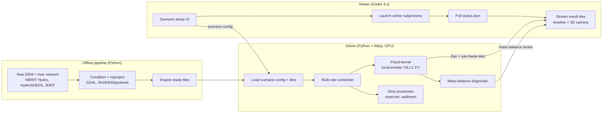

# River Basin Simulator — Development Handoff

> Handoff document to continue development in Claude Code. It is self-contained:
> everything needed to start building is here, including locked decisions, the
> component contracts, the numerics spec, and a milestone-by-milestone build order.
>
> **First action for Claude Code:** read this file end-to-end, then scaffold the repo
> per §6 and begin Milestone M0 (§9). Add a short `CLAUDE.md` that points here and
> records project conventions as they emerge.

---

## 1. What we are building

A **batch hydrodynamic river-basin simulator** for large spatial domains, with an
interactive 3D viewer for setting up scenarios and exploring results.

The loop is **configure → run → explore**:

1. **Configure** a scenario — terrain, rainfall, parameter fields (roughness,
   infiltration), structures (dams, levees), boundary conditions, run settings.
2. **Run** a GPU shallow-water simulation over a large domain. The run takes
   whatever wall-time it needs (seconds to overnight); it is *not* real-time.
3. **Explore** the stored time-series results in a 3D viewer — scrub the timeline,
   fly the camera, toggle depth/velocity layers, compare scenarios.

Long-term capability growth path (each stage is an independent, shippable milestone):
rainfall → watersheds → river routing → flooding → reservoir operations →
sediment transport → larger (continental) scales.

This is a **faithful research/education sandbox**, validated against standard
benchmarks — not a regulatory-certification tool. State that honestly anywhere it
matters.

---

## 2. Locked decisions — do not re-litigate

These were settled through deliberate trade-off analysis. Treat them as fixed unless
the developer explicitly reopens one.

| Area | Decision | One-line rationale |
|---|---|---|
| Priority | **Large scale + fidelity; NOT real-time** | Dropping real-time is what frees the compute budget for both reach and accuracy. |
| Developer / target | **Solo developer, desktop, NVIDIA GPU** | NVIDIA is a hard commitment; lean on off-the-shelf where possible. |
| Solver location | **Standalone, fully decoupled from the viewer** | Collapses the engine↔renderer seam to a file handoff; solver iterates independently. |
| Solver framework | **NVIDIA Warp** (Python kernels → CUDA) | Python-speed iteration on the hard numerics; NVIDIA-native; clean NumPy/array interop for validation. |
| GPU | **Yes — required** | At reach scale the GPU buys *area and resolution within wall-time*, not framerate. |
| Viewer | **Godot 4.x** (latest stable 4.x) | Lighter engine is fine since it only renders result fields; no physics inside it. |
| Spatial (start) | **Tiled uniform raster** | Simplest, GPU-trivial, conservative; the MVP foundation. |
| Spatial (scale path) | **Multi-resolution + sub-grid channels + 1D river network** | How reach is bought within memory/wall-time; added later behind a stable cell interface. |
| Flood numerics (start) | **Local-inertial (Bates 2010)** | Cheap, stable, GPU-perfect; also the permanent *coverage* tool for lowland floodplains. |
| Flood numerics (fidelity) | **Well-balanced Godunov FV with HLLC** | Correct shocks, transcritical flow, the validatable gold standard. |
| Precision | **float32 GPU fields + float64/Kahan mass accumulator** | Consumer NVIDIA GPUs throttle float64 hard; protect the diagnostic that matters. |
| Time integration | **Multi-rate scheduler, single simulated clock, deterministic adaptive CFL dt, operator splitting** | Floods, sediment, reservoirs run at their natural rates; reproducible. |
| Reproducibility | **Scenario = config + parameter fields + command log; deterministic stepping** | A run is fully reproducible and shareable. |
| Result store | **Zarr (canonical) + per-frame tiled float32 + JSON manifest (viewer)** | Chunked large time-series for analysis; lean floats for Godot streaming. |

**Rejected alternatives worth recording:** Taichi (cross-vendor advantage moot once
NVIDIA-only; revisit only if multi-vendor becomes a goal — its sparse spatial data
structures are attractive for multi-resolution). Unity (heavier than needed once the
solver left the engine). Raw C++/CUDA or Rust+wgpu for the *whole* solver (premature;
see §12 — port only profiled hot kernels, only if needed).

---

## 3. Non-goals / explicitly deferred

Do **not** build these unless asked; flag if a task drifts toward them.

- **Real-time / live simulation as the primary mode.** A low-res live *preview* for
  setup intuition is allowed but deferred to late.
- **Whole-country at meter resolution with full dynamic-wave physics.** Beyond a
  desktop even overnight; multi-resolution is how scale is handled instead.
- **Cross-vendor GPU portability.** NVIDIA only.
- **Engineering-certification-grade accuracy guarantees.** Validate against
  benchmarks; do not imply regulatory fitness.
- **App packaging / distribution.** Python-runtime solver is fine for now; package later.

---

## 4. Architecture

Three independent components connected by files. No shared memory, no shared process.



The seam is a **contract, not code coupling**: the solver consumes a config + tiles
and emits results; the viewer launches it and reads what it writes. Either side can be
rewritten independently as long as the formats in §7 hold.

---

## 5. Tech stack

**Solver / pipeline (Python 3.11+):**
- `warp-lang` (NVIDIA Warp) — GPU kernels
- `numpy`, `zarr`, `xarray` — arrays + result store + analysis
- `rasterio`/GDAL, `richdem` or `pysheds` — DEM conditioning, flow routing
- `matplotlib` — validation plots
- NVIDIA driver + matching CUDA toolkit (verify Warp ↔ CUDA ↔ driver compatibility first)

**Viewer:**
- Godot 4.x (latest stable), GDScript
- Terrain LOD: `Terrain3D` plugin **or** a custom clipmap/quadtree heightmap
- Custom shaders: depth/velocity colormap; water surface lifted off the depth field
- Optional GDExtension (C++) only for a proven viewer hot path

**Interchange formats:**
- Canonical: **Zarr** (chunked, tiled, time-series) + scenario config (TOML)
- Viewer playback: per-frame tiled **raw float32** + **JSON manifest**
- Run control: **status.json**

---

## 6. Repository layout

```
river-basin-sim/
├── README.md
├── HANDOFF.md                  # this document
├── CLAUDE.md                   # short pointer to HANDOFF.md + conventions (create in M0)
├── pyproject.toml              # or requirements.txt
├── pipeline/                   # offline data prep
│   ├── condition.py            # sink-fill, flow dir/accum, reproject
│   ├── tile.py                 # cut conditioned rasters into engine tiles
│   └── sources.md              # data sources + licensing notes
├── solver/
│   ├── core/
│   │   ├── grid.py             # tiled grid, indexing, staggering
│   │   ├── state.py            # h, hu, hv (+ bed z) field containers
│   │   ├── local_inertial.py   # M1 scheme
│   │   ├── hllc_fv.py          # M4 scheme
│   │   ├── friction.py         # Manning, semi-implicit
│   │   ├── boundaries.py       # closed / open / inflow / fixed-stage
│   │   └── massbalance.py      # Kahan/float64 global accounting
│   ├── scheduler.py            # multi-rate clock + operator splitting
│   ├── processes/              # rainfall, reservoir, sediment (added over milestones)
│   ├── io/
│   │   ├── config.py           # load/validate scenario TOML
│   │   ├── zarr_writer.py      # canonical store
│   │   ├── viewer_export.py    # per-frame tiles + manifest
│   │   └── status.py           # status.json progress
│   └── run.py                  # entry point: config → run → results
├── viewer/                     # Godot 4.x project
│   ├── project.godot
│   ├── scenes/
│   ├── scripts/                # subprocess launch, tile streaming, timeline
│   └── shaders/                # depth/velocity colormap, water surface
├── scenarios/                  # example configs + saved command logs
├── validation/                 # dam-break, lake-at-rest, EA 2D + analytical refs
├── data/                       # gitignored: DEMs, tiles, results
└── docs/
```

---

## 7. Component contracts

These are the high-value, stable interfaces. Implement them early and treat changes as
deliberate versioned events.

### 7.1 Scenario config (input → solver)

TOML. Example:

```toml
[meta]
name = "demo_basin_rain"
seed = 12345
scheme = "local_inertial"        # "local_inertial" | "hllc_fv"

[grid]
tiles_dir = "data/tiles/demo"    # engine-ready terrain tiles
dx = 30.0                        # cell size, metres
crs = "EPSG:32633"

[run]
end_time = 86400.0               # simulated seconds
output_every = 600.0             # write cadence, simulated seconds
cfl = 0.45
dt_max = 30.0

[rainfall]
type = "uniform"                 # "uniform" | "field" | "timeseries" | "storm_cells"
rate_mm_hr = 25.0
duration_s = 7200.0

[parameters]
manning_n = 0.035                # scalar OR path to a field raster
infiltration = "data/fields/infil.tif"

[[structures]]
type = "dam"
cell = [412, 980]
crest_m = 145.0
release_rule = "fixed"           # added at M5

[boundaries]
default = "closed"               # "closed" | "open" | "inflow" | "fixed_stage"
# per-edge / per-segment overrides...

# command log (edits applied at safe sync points) appended here or in a sidecar
```

### 7.2 Canonical result store (solver → analysis/viewer)

Zarr group. Dimensions `(time, y, x)`, chunked for tiled streaming.

```
results.zarr/
├── .zattrs                 # crs, dx, units, scheme, mass_balance_series, run hash
├── time                    # (T,) simulated seconds
├── depth                   # (T, Y, X) float32  water depth h
├── u, v                    # (T, Y, X) float32  depth-averaged velocity
├── bed                     # (Y, X)    float32  bed elevation z (static unless morpho)
└── [sediment, ...]         # added in later milestones
```

Chunking: align chunks to viewer tiles (e.g. 512×512) and one timestep per chunk on the
time axis so playback streams cheaply.

### 7.3 Per-frame viewer format (solver → Godot)

Godot cannot read Zarr natively — do not make it try. Export a parallel lean stream:

```
frames/
├── manifest.json           # frame list, times, per-field global min/max, tile grid
├── f0000_depth_t00_00.raw  # raw little-endian float32, one tile
├── f0000_vel_t00_00.raw
└── ...
```

`manifest.json` carries per-frame, per-field min/max so the viewer can colormap without
scanning data. Godot loads raw floats straight into textures.

### 7.4 Solver ↔ Godot subprocess protocol

1. Viewer writes the scenario TOML.
2. Viewer launches the solver as a subprocess: `python -m solver.run --config <path>`.
3. Solver writes `status.json` periodically: `{state, progress, sim_time, eta_s, message}`
   where `state ∈ {starting, running, writing, done, error}`.
4. Viewer polls `status.json`; on `done`, loads the manifest + tiles and enables playback.

This config-in / results-out shape **is** the reproducibility and sharing story:
config + parameter fields + command log fully determine a run.

---

## 8. Numerics specification

Implement to this level; the cited references give the exact formulae.

**Governing equations — 2D shallow water (conservative form):**

∂U/∂t + ∂F/∂x + ∂G/∂y = S, with state `U = [h, hu, hv]`.

- `F = [hu, hu² + ½gh², huv]`, `G = [hv, huv, hv² + ½gh²]`
- Source `S = [R, −gh ∂z/∂x − ghS_fx, −gh ∂z/∂y − ghS_fy]`
- `R` = rainfall (minus infiltration); `z` = bed elevation
- Manning friction slope: `S_fx = n² u √(u²+v²) / h^(4/3)` (and y-analog)

**MVP scheme — local-inertial (Milestone M1).**
Bates, Horritt & Fewtrick (2010). Drops the advective acceleration term; explicit,
staggered grid, GPU-perfect. Flux update per face:

`q^{n+1} = ( q^n − g·h_flow·Δt·∂(h+z)/∂x ) / ( 1 + g·Δt·n²·|q^n| / h_flow^{7/3} )`

then continuity `h^{n+1} = h^n + Δt·(Σq_in − Σq_out)/Δx`. `h_flow` is the depth at the
face (max water surface − max bed). Stable step `Δt ≈ α·Δx/√(g·h_max)`, `α ≈ 0.7`.
This is also the **permanent coverage scheme** for vast lowland floodplains.

**Fidelity scheme — well-balanced Godunov FV with HLLC (Milestone M4).**
Finite-volume cell averages; MUSCL slope-limited reconstruction to faces; **hydrostatic
reconstruction** for the bed-slope source so the lake-at-rest state is preserved exactly
(Audusse et al. 2004); **HLLC** approximate Riemann flux at faces (Toro); SSP-RK2 time
integration; semi-implicit friction. See Liang & Borthwick (2009) for a well-balanced
SWE formulation. CFL: `Δt = C·min( Δx / (|u| + √(gh)) )`, `C ≈ 0.4–0.5`.

**Wetting/drying:** dry-cell threshold `h_dry` (e.g. 1e-3 m); zero velocity below it;
guard against negative depths; use hydrostatic reconstruction to avoid spurious fluxes
at wet/dry fronts.

**Boundary conditions:** closed (reflective), open/transmissive, inflow hydrograph
(prescribed discharge), fixed stage (prescribed water surface).

**Mass-balance diagnostic (the credibility gauge):** accumulate
`inflow − outflow − ΔstoredVolume` each step using **float64 / Kahan summation** even
though fields are float32. Surface the running relative error to the viewer; it is the
honest "is this still physical" readout. A run whose error exceeds threshold is a bug.

**Time integration / multi-rate (Milestone M5):** one simulated clock; the flood kernel
sub-cycles with a deterministic adaptive `Δt` computed from state (never from wall-clock
or framerate); slow processes (reservoir daily rules, sediment morphology on a long
clock) advance at sync points via operator splitting.

---

## 9. Build order (each milestone is independently demoable)

- **M0 — Foundation.** Repo scaffold (§6), Python env (§11), `CLAUDE.md`. Data pipeline:
  load a sample DEM, condition (sink-fill + flow dir/accum), tile, export. Static 3D
  terrain loads in Godot. *No dynamics yet — proves pipeline + viewer + handoff.*
- **M1 — Water moves.** Local-inertial solver on a uniform tiled raster in Warp.
  Uniform rainfall, closed BCs, Zarr output, live mass-balance diagnostic.
  **Validate: dam-break** against the analytical solution. *First "water moves."*
- **M2 — The loop closes.** Implement the §7 contracts: config-in/results-out, subprocess
  launch + `status.json` progress, per-frame tile export. Godot timeline scrubber, depth
  colormap, water surface. *Now it's a real configure→run→explore sandbox.*
- **M3 — Real scenarios.** Scenario system + command log + spatially-varying parameter
  fields (roughness, infiltration). Inflow hydrographs and open boundaries.
- **M4 — Fidelity step.** Add well-balanced HLLC FV behind the same kernel interface.
  **Validate: lake-at-rest** (well-balancedness) and the **UK EA 2D benchmark suite**.
- **M5 — Multi-physics.** Multi-rate scheduler, exercised by adding reservoir operations
  (cheap, and forces the scheduler to be real).
- **M6 — Reach.** Multi-resolution / tiling-at-scale + sub-grid channel parameterization,
  optionally a 1D river network for the largest domains. *Highest-risk subsystem — see §12.*
- **M7 — Morphology.** Sediment transport (Exner + transport capacity) on the slow clock.

---

## 10. Validation plan

Keep these in `validation/` and run them headlessly (the batch driver doubles as the
regression harness — essential for a solo project).

- **Dam-break (M1):** analytical Stoker/Ritter solution — checks shock speed and wave
  shape; the basic correctness gate.
- **Lake-at-rest (M4):** flat water surface over arbitrary bed must stay flat with zero
  velocity — proves the scheme is well-balanced (no spurious currents on slopes).
- **UK Environment Agency 2D benchmark suite (M4):** the standard battery for realistic
  flood behaviour.
- **Global mass balance (always):** relative error must stay below a fixed threshold for
  every run; treat exceedance as a failing test.

---

## 11. Environment setup

1. Install the NVIDIA driver + a CUDA toolkit compatible with the chosen Warp release.
   Verify `warp` initializes and sees the GPU before anything else.
2. Python venv; install `warp-lang numpy zarr xarray rasterio richdem matplotlib`
   (swap `richdem`→`pysheds` if preferred; `rasterio` pulls GDAL).
3. Install Godot 4.x (latest stable). Add the `Terrain3D` plugin or plan a custom
   clipmap (§12).
4. Smoke test: a tiny Warp kernel writing a known array to Zarr, read back in xarray.

---

## 12. Risks & watch-items

- **Multi-resolution + sub-grid coupling conservation (M6) — highest risk.** Mass must be
  conserved exactly across resolution boundaries and 1D↔2D exchange cells. Build it
  incrementally with a dedicated conservation test before trusting any result.
- **float32 conservation drift at scale.** Billions of cell-updates accumulate error;
  the float64/Kahan mass-balance gate (§8) is the guard. Do not skip it.
- **Wetting/drying instabilities.** The classic source of NaNs/blow-ups; rely on
  hydrostatic reconstruction and a clean dry threshold.
- **Godot terrain LOD at reach scale.** The viewer's one demanding job; clipmap/quadtree
  heightmap + custom shaders is real work, not turnkey.
- **Premature optimization.** Prototype and validate everything in Warp first. Port a
  kernel to hand-written CUDA only after profiling proves it's the bottleneck — that's a
  maintenance fork, entered deliberately.
- **Determinism.** Adaptive `Δt` must derive from state, not wall-clock; otherwise runs
  stop reproducing and validation/sharing break.

---

## 13. Kickoff task for Claude Code

1. Create the repo per §6 and a `CLAUDE.md` pointing here.
2. Set up the Python environment (§11) and run the §11 smoke test.
3. Implement the **M0** data pipeline: load a sample DEM (start with a small SRTM/3DEP
   tile), condition it (sink-fill + D8 flow direction + flow accumulation), cut into
   engine tiles, and export.
4. Stand up a minimal Godot scene that loads one terrain tile as a 3D heightmap.
5. Stop at the M0 demo and confirm before starting **M1** (local-inertial solver).

Work milestone by milestone; keep each one demoable; let the mass-balance diagnostic and
the validation harness gate every step.
