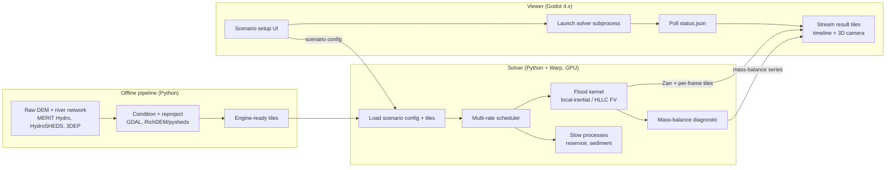

# River Basin Simulator — Development Handoff

> Handoff document to continue development in Claude Code. It is self-contained:
> everything needed to start building is here, including locked decisions, the
> component contracts, the numerics spec, and a milestone-by-milestone build order.
>
> **First action for Claude Code:** read this file end-to-end, then scaffold the repo
> per §6 and begin Milestone M0 (§9). Add a short `CLAUDE.md` that points here and
> records project conventions as they emerge.
>
> **This is the spec, not the status board.** Where each milestone stands — what is
> signed off, on what hardware, with which measured figures and carried limitations —
> lives in `CLAUDE.md` and `docs/plans/` (`roadmap.md` plus one plan per milestone).
> A finding is folded in here only when it changes a **contract** (§7), a **numerical
> rule** (§8), a **gate** (§10) or a **risk** (§12); measurements stay in the plans.

---

## 1. What we are building

A **batch hydrodynamic river-basin simulator** for large spatial domains, with an
interactive 3D viewer for setting up scenarios and exploring results.

The loop is **configure → run → explore**:

1. **Configure** a scenario — terrain, rainfall, parameter fields (roughness,
   infiltration), structures (dams, levees), boundary conditions, run settings.
2. **Run** a GPU shallow-water simulation over a large domain. The run takes
   whatever wall-time it needs (seconds to overnight); it is *not* real-time.
3. **Explore** the stored time-series results in a 3D viewer — scrub the timeline,
   fly the camera, toggle depth/velocity layers, compare scenarios.

Long-term capability growth path (each stage is an independent, shippable milestone):
rainfall → watersheds → river routing → flooding → reservoir operations →
sediment transport → larger (continental) scales.

This is a **faithful research/education sandbox**, validated against standard
benchmarks — not a regulatory-certification tool. State that honestly anywhere it
matters.

---

## 2. Locked decisions — do not re-litigate

These were settled through deliberate trade-off analysis. Treat them as fixed unless
the developer explicitly reopens one.

| Area | Decision | One-line rationale |
|---|---|---|
| Priority | **Large scale + fidelity; NOT real-time** | Dropping real-time is what frees the compute budget for both reach and accuracy. |
| Developer / target | **Solo developer, desktop, NVIDIA GPU** | NVIDIA is a hard commitment; lean on off-the-shelf where possible. |
| Solver location | **Standalone, fully decoupled from the viewer** | Collapses the engine↔renderer seam to a file handoff; solver iterates independently. |
| Solver framework | **NVIDIA Warp** (Python kernels → CUDA) | Python-speed iteration on the hard numerics; NVIDIA-native; clean NumPy/array interop for validation. |
| GPU | **Yes — required** | At reach scale the GPU buys *area and resolution within wall-time*, not framerate. |
| Viewer | **Godot 4.x** (latest stable 4.x) | Lighter engine is fine since it only renders result fields; no physics inside it. |
| Spatial (start) | **Tiled uniform raster** | Simplest, GPU-trivial, conservative; the MVP foundation. |
| Spatial (scale path) | **Multi-resolution + sub-grid channels + 1D river network** | How reach is bought within memory/wall-time; added later behind a stable cell interface. |
| Flood numerics (start) | **Local-inertial (Bates 2010)** | Cheap, stable, GPU-perfect; also the permanent *coverage* tool for lowland floodplains. |
| Flood numerics (fidelity) | **Well-balanced Godunov FV with HLLC** | Correct shocks, transcritical flow, the validatable gold standard. |
| Precision | **float32 GPU fields + float64/Kahan mass accumulator** | Consumer NVIDIA GPUs throttle float64 hard; protect the diagnostic that matters. |
| Time integration | **Multi-rate scheduler, single simulated clock, deterministic adaptive CFL dt, operator splitting** | Floods, sediment, reservoirs run at their natural rates; reproducible. |
| Reproducibility | **Scenario = config + parameter fields + command log; deterministic stepping** | A run is fully reproducible and shareable. |
| Result store | **Zarr (canonical) + per-frame tiled float32 + JSON manifest (viewer)** | Chunked large time-series for analysis; lean floats for Godot streaming. |

**Rejected alternatives worth recording:** Taichi (cross-vendor advantage moot once
NVIDIA-only; revisit only if multi-vendor becomes a goal — its sparse spatial data
structures are attractive for multi-resolution). Unity (heavier than needed once the
solver left the engine). Raw C++/CUDA or Rust+wgpu for the *whole* solver (premature;
see §12 — port only profiled hot kernels, only if needed).

---

## 3. Non-goals / explicitly deferred

Do **not** build these unless asked; flag if a task drifts toward them.

- **Real-time / live simulation as the primary mode.** A low-res live *preview* for
  setup intuition is allowed but deferred to late.
- **Whole-country at meter resolution with full dynamic-wave physics.** Beyond a
  desktop even overnight; multi-resolution is how scale is handled instead.
- **Cross-vendor GPU portability.** NVIDIA only.
- **Engineering-certification-grade accuracy guarantees.** Validate against
  benchmarks; do not imply regulatory fitness.
- **App packaging / distribution.** Python-runtime solver is fine for now; package later.

---

## 4. Architecture

Three independent components connected by files. No shared memory, no shared process.


```mermaid
flowchart LR
    subgraph Offline["Offline pipeline (Python)"]
        A[Raw DEM + river network<br/>MERIT Hydro, HydroSHEDS, 3DEP] --> B[Condition + reproject<br/>GDAL, RichDEM/pysheds]
        B --> C[Engine-ready tiles]
    end

    subgraph Solver["Solver (Python + Warp, GPU)"]
        D[Load scenario config + tiles] --> E[Multi-rate scheduler]
        E --> F[Flood kernel<br/>local-inertial / HLLC FV]
        F --> G[Mass-balance diagnostic]
        E --> H[Slow processes<br/>reservoir, sediment]
    end

    subgraph Viewer["Viewer (Godot 4.x)"]
        I[Scenario setup UI] --> J[Launch solver subprocess]
        J --> K[Poll status.json]
        K --> L[Stream result tiles<br/>timeline + 3D camera]
    end

    C --> D
    I -->|scenario config| D
    F -->|Zarr + per-frame tiles| L
    G -->|mass-balance series| L
```

The seam is a **contract, not code coupling**: the solver consumes a config + tiles
and emits results; the viewer launches it and reads what it writes. Either side can be
rewritten independently as long as the formats in §7 hold.

---

## 5. Tech stack

**Solver / pipeline (Python 3.11+):**
- `warp-lang` (NVIDIA Warp) — GPU kernels
- `numpy`, `zarr`, `xarray` — arrays + result store + analysis
- `rasterio`/GDAL, `richdem` or `pysheds` — DEM conditioning, flow routing
- `matplotlib` — validation plots
- NVIDIA driver + matching CUDA toolkit (verify Warp ↔ CUDA ↔ driver compatibility first)

**Viewer:**
- Godot 4.x (latest stable), GDScript
- Terrain LOD: `Terrain3D` plugin **or** a custom clipmap/quadtree heightmap
- Custom shaders: depth/velocity colormap; water surface lifted off the depth field
- Optional GDExtension (C++) only for a proven viewer hot path

**Interchange formats:**
- Canonical: **Zarr** (chunked, tiled, time-series) + scenario config (TOML)
- Viewer playback: per-frame tiled **raw float32** + **JSON manifest**
- Run control: **status.json**

---

## 6. Repository layout

```
river-basin-sim/
├── README.md
├── HANDOFF.md                  # this document
├── CLAUDE.md                   # short pointer to HANDOFF.md + conventions (create in M0)
├── pyproject.toml              # or requirements.txt
├── pipeline/                   # offline data prep
│   ├── condition.py            # sink-fill, flow dir/accum, reproject
│   ├── tile.py                 # cut conditioned rasters into engine tiles
│   ├── channels.py             # sub-grid channel fields from flow accumulation (M6)
│   └── sources.md              # data sources + licensing notes
├── solver/
│   ├── core/
│   │   ├── grid.py             # tiled grid, indexing, staggering
│   │   ├── state.py            # h, hu, hv (+ bed z) field containers
│   │   ├── schemes.py          # dispatch: scheme name → module owning compute_dt/step
│   │   ├── local_inertial.py   # M1 scheme
│   │   ├── hllc.py             # M4 scheme
│   │   ├── channels.py         # sub-grid channel geometry + storage curve (M6)
│   │   ├── sources.py          # compensated areal-source accumulation (§8)
│   │   ├── datum.py            # vertical datum shift z' = z − z_ref (M5)
│   │   ├── friction.py         # Manning, semi-implicit (shared by both schemes)
│   │   ├── boundaries.py       # closed / open / inflow / fixed-stage
│   │   └── massbalance.py      # Kahan/float64 global accounting
│   ├── scheduler.py            # multi-rate clock + operator splitting
│   ├── processes/              # inflow.py, reservoir.py (sediment added at M7)
│   ├── io/
│   │   ├── config.py           # load/validate scenario TOML
│   │   ├── mosaic.py           # the domain is the tile mosaic; windowing (M6)
│   │   ├── coarsen.py          # run k× coarser than the tiles, dx' = k·dx (M6)
│   │   ├── fields.py           # spatially-varying parameter fields (.r32) (M3)
│   │   ├── zarr_writer.py      # canonical store
│   │   ├── viewer_export.py    # per-frame tiles + manifest
│   │   ├── provenance.py       # command log: source hashes + resolved scenario
│   │   └── status.py           # status.json progress
│   └── run.py                  # entry point: config → run → results
├── viewer/                     # Godot 4.x project
│   ├── project.godot
│   ├── scenes/
│   ├── scripts/                # subprocess launch, tile streaming, timeline
│   └── shaders/                # depth/velocity colormap, water surface
├── scenarios/                  # example configs + saved command logs
├── scripts/                    # demo terrain/field generators, toolchain smoke test
├── validation/                 # dam-break, lake-at-rest, EA 2D + analytical refs
├── data/                       # gitignored: DEMs, tiles, results
└── docs/
    └── plans/                  # roadmap + one plan per milestone (status lives here)
```

**Where tests live.** Unit tests sit beside the code they cover as
`solver/**/test_*.py` and `pipeline/test_pipeline.py`; `validation/` holds the physics
gates of §10 (analytical solutions, the EA suite, the sub-grid and drain cases), which
are the ones that may not be relaxed to make a change pass.

---

## 7. Component contracts

These are the high-value, stable interfaces. Implement them early and treat changes as
deliberate versioned events.

### 7.1 Scenario config (input → solver)

TOML. Illustrative — `solver/io/config.py` holds the authoritative key set and is the
only place it is enumerated; an unknown key inside a known table warns and is ignored,
and a known-but-unbuilt feature raises a `ConfigError` naming the milestone that will
open it. Do not maintain a second gate list here.

```toml
[meta]
name = "demo_basin_rain"
seed = 12345
scheme = "local_inertial"        # "local_inertial" | "hllc_fv"

[grid]
tiles_dir = "data/tiles/demo"    # engine-ready terrain tiles (dx/crs inherit from tiles.json)
tiles = "all"                    # "all" — the domain is the whole mosaic — | "first"
window = [0, 0, 1535, 1535]      # optional inclusive [r0, c0, r1, c1] in mosaic coords
coarsen = 2                      # run k× coarser than the tiles: dx' = k·dx
dx = 30.0                        # cell size, metres (override)
crs = "EPSG:32633"
datum = "auto"                   # vertical shift z' = z − z_ref: "auto" | elevation | absent

[run]
end_time = 86400.0               # simulated seconds
output_every = 600.0             # write cadence, simulated seconds
cfl = 0.45                       # HLLC wants ~0.45; local-inertial tolerates ~0.7
dt_max = 30.0

[rainfall]
type = "uniform"                 # "uniform" | "field"; "timeseries" | "storm_cells" deferred
rate_mm_hr = 25.0
duration_s = 7200.0

[parameters]
manning_n = 0.035                # scalar OR path to a parameter field
infiltration = 2.0               # mm/hr, scalar OR field

[channels]                       # sub-grid channels (M6) — local-inertial only
width = "data/fields/channel_width.r32"   # w (m), 0 < w ≤ dx; 0 = no channel
depth = "data/fields/channel_depth.r32"   # d (m) bank-full, below the floodplain bed
manning = 0.03                            # the channel's own roughness

[[inflow]]                       # point-source hydrograph, piecewise-linear Q(t)
cell = [4, 768]
hydrograph = [[0.0, 5.0], [3600.0, 60.0], [18000.0, 10.0]]

[[structures]]
name = "valley_dam"
type = "dam"
cells = [[412, 980], [412, 981]]  # the barrier: these cells' bed is raised to the crest
crest_m = 145.0
release_rule = "target_stage"     # "fixed" | "target_stage"
target_stage_m = 140.0
pool = [400, 970, 411, 995]       # inclusive [r0, c0, r1, c1] — where the stage is read
outlet = [414, 972, 422, 992]     # a box: deliver over a reach, not one cell (§8)
interval_s = 900.0                # slow-clock cadence — a scheduler sync point

[boundaries]
default = "closed"               # "closed" | "open"
south = "open"                   # per-edge override: north | south | east | west
east = { type = "fixed_stage", level = 10.0 }   # or stage = [[t, level], ...]
```

A prescribed-surface edge is **per-edge and needs a level**, so it takes the table form
rather than a bare type name; the `inflow` boundary *type* stays deferred in favour of
`[[inflow]]` cell sources, whose mass accounting is exact by construction.

**Cell indices are in the assembled-domain frame** — after `window`, before `coarsen`.
The solver maps them `i // k` and refuses any that leave the resolved domain, so a
config does not have to be rewritten to change resolution.

The command log (edits applied at safe sync points) is appended here or in a sidecar;
`solver/io/provenance.py` records the resolved scenario plus source and field hashes
into `.zattrs` and a `<store>.provenance.json`, which is what makes a run reproducible
from the store alone.

### 7.2 Canonical result store (solver → analysis/viewer)

Zarr group. Dimensions `(time, y, x)`, chunked for tiled streaming.

```
results.zarr/
├── .zattrs                 # crs, dx, coarsen, datum_shift_m, units, scheme,
│                           #   domain, channels, mass_* series, provenance
├── time                    # (T,) simulated seconds
├── depth                   # (T, Y, X) float32  water depth h
├── u, v                    # (T, Y, X) float32  depth-averaged velocity
├── bed                     # (Y, X)    float32  bed elevation z (static unless morpho)
├── channel_width           # (Y, X)    float32  sub-grid channel w, when present
├── channel_depth           # (Y, X)    float32  sub-grid channel d, when present
└── [sediment, ...]         # added in later milestones
```

Chunking: align chunks to viewer tiles (e.g. 512×512) and one timestep per chunk on the
time axis so playback streams cheaply.

**A store describes the grid the run actually stepped, not the tiles it was built
from.** `dx` is the *run's* cell size (already `k·dx_tiles`), `coarsen` records `k`, and
`domain` carries the mosaic assembly record — origin, tiles used, uncovered cells and
their fill value. `bed` is stored **un-shifted** (true elevations) even when `[grid]
datum` moved the run; `datum_shift_m` is provenance, not a decoding key. From M6 the
bed alone no longer describes the bed: where sub-grid channels exist, `channel_width` /
`channel_depth` ride alongside as statics, because `z` is the floodplain surface and the
channel bed is `z − d`. A reader that ignores them will draw the wrong water surface.

### 7.3 Per-frame viewer format (solver → Godot)

Godot cannot read Zarr natively — do not make it try. Export a parallel lean stream:

```
frames/
├── manifest.json           # frame list, times, per-field global min/max, tile grid
├── f0000_depth_t00_00.raw  # raw little-endian float32, one tile
├── f0000_vel_t00_00.raw
├── bed_t00_00.raw          # the run's own bed, once (manifest["static"])
└── ...
```

`manifest.json` carries per-frame, per-field min/max so the viewer can colormap without
scanning data. Godot loads raw floats straight into textures.

The **static** section ships the run's bed through the same tile layout and the same
entry shape as a frame, so one reader decodes both. It is what the viewer renders as
terrain: from M6 the domain is a tile *mosaic*, optionally windowed and coarsened, so
no tile on disk is the surface the run stepped on — only the store's `bed` is, and
shipping it makes the water register with the terrain by construction rather than by
the viewer re-deriving the mosaic. `manifest["domain"]` carries the assembly record
(origin, tiles used, gap cells, fill value) beside it: uncovered cells are filled flat,
and a picture must be able to say so.

**`manifest.json` is the only authoritative record of which files belong to a run.**
Frame tiles are named by field and index, every scenario writes to the same default
output directory, and the export does not purge what was there — so a directory can
hold two runs at different grid sizes under the same names, told apart only by byte
size. Never reconstruct a frame filename by index and never read a directory listing
as "the last run's output"; read the manifest. The reader's tile-size check is a
backstop that yields a hole, not an error.

**Known gap.** The static section ships `bed` but not the sub-grid channel geometry the
canonical store carries (§7.2). A viewer therefore cannot reconstruct the storage curve
and must lift water as `bed + depth`, which draws the surface over a channel cell up to
`d` too high. Closing it means shipping `w`/`d` through the same static mechanism —
anything else the composite depends on travels the same way, or it does not register.

### 7.4 Solver ↔ Godot subprocess protocol

1. Viewer writes the scenario TOML.
2. Viewer launches the solver as a subprocess: `python -m solver.run --config <path>`.
3. Solver writes `status.json` periodically: `{state, progress, sim_time, eta_s, message}`
   where `state ∈ {starting, running, writing, done, error}`.
4. Viewer polls `status.json`; on `done`, loads the manifest + tiles and enables playback.

This config-in / results-out shape **is** the reproducibility and sharing story:
config + parameter fields + command log fully determine a run.

---

## 8. Numerics specification

Implement to this level; the cited references give the exact formulae.

**Governing equations — 2D shallow water (conservative form):**

∂U/∂t + ∂F/∂x + ∂G/∂y = S, with state `U = [h, hu, hv]`.

- `F = [hu, hu² + ½gh², huv]`, `G = [hv, huv, hv² + ½gh²]`
- Source `S = [R, −gh ∂z/∂x − ghS_fx, −gh ∂z/∂y − ghS_fy]`
- `R` = rainfall (minus infiltration); `z` = bed elevation
- Manning friction slope: `S_fx = n² u √(u²+v²) / h^(4/3)` (and y-analog)

**MVP scheme — local-inertial (Milestone M1).**
Bates, Horritt & Fewtrick (2010). Drops the advective acceleration term; explicit,
staggered grid, GPU-perfect. Flux update per face:

`q^{n+1} = ( q^n − g·h_flow·Δt·∂(h+z)/∂x ) / ( 1 + g·Δt·n²·|q^n| / h_flow^{7/3} )`

then continuity `h^{n+1} = h^n + Δt·(Σq_in − Σq_out)/Δx`. `h_flow` is the depth at the
face (max water surface − max bed). Stable step `Δt ≈ α·Δx/√(g·h_max)`, `α ≈ 0.7`.
This is also the **permanent coverage scheme** for vast lowland floodplains.

**Fidelity scheme — well-balanced Godunov FV with HLLC (Milestone M4).**
Finite-volume cell averages; MUSCL slope-limited reconstruction to faces; **hydrostatic
reconstruction** for the bed-slope source so the lake-at-rest state is preserved exactly
(Audusse et al. 2004); **HLLC** approximate Riemann flux at faces (Toro); SSP-RK2 time
integration; semi-implicit friction. See Liang & Borthwick (2009) for a well-balanced
SWE formulation. CFL: `Δt = C·min( Δx / (|u| + √(gh)) )`, `C ≈ 0.4–0.5`.

**Scheme selection, and features that belong to one scheme.** The two schemes coexist
by selection, not replacement — local-inertial is the permanent coverage scheme (§2),
not a stepping stone. Dispatch is by name to a module owning `compute_dt`/`step`, and
momentum `hu/hv` is optional armed state so the LI path stays bitwise unchanged when a
fidelity feature is added. Some features are genuinely scheme-specific: `fixed_stage`
is HLLC-only (LI has no boundary face to prescribe a surface on) and sub-grid channels
are LI-only. **A scheme-specific feature refuses loudly** — a config error naming the
combination — rather than being silently ignored or silently degraded on the other
scheme. Expect to make this call again for M7's sediment.

**Wetting/drying:** dry-cell threshold `h_dry` (e.g. 1e-3 m); zero velocity below it;
use hydrostatic reconstruction to avoid spurious fluxes at wet/dry fronts. The
first-order drop near dry cells must be applied **identically in the flux and the
source kernels**, or Audusse's exact balance breaks. Note that well-balancedness is
easy to *almost* get: a fully-wet lake will not catch reconstruction that misbehaves
across a **shoreline**, where a dry neighbour injects a spurious water/bed slope into
the limiter stencil. Test on a bumpy bed with dry islands.

**Positivity — never with a bare `max(h, 0)`.** Clamping a negative depth to zero
invents mass and silently breaks the ledger and any boundary banking. Both schemes
instead use a **conservative donor-cell β mass-flux limiter**: scale each mass face by
its upwind cell's `min(1, h/out_depth)`, so a shared face is scaled once, by its donor,
and mass is conserved exactly. This is what makes depths non-negative out of regime,
including on beds far steeper than local-inertial's assumptions — with the caveat that
limiter-shaped velocities are not validated hydraulics and must not be reported as
though they were.

**Boundary conditions:** closed (reflective), open/transmissive, inflow hydrograph
(prescribed discharge), fixed stage (prescribed water surface). Whatever crosses a
boundary is **banked into the float64 ledger at the moment it crosses** — in both
directions — so an open or prescribed edge is accounted, not leaked. Use float64 for
the loss accumulator specifically because open outflow concentrates at one edge cell.

**Vertical datum (M5):** float32 `η = h + z` loses the depth inside the elevation when
`z` is large. `[grid] datum` runs in shifted coordinates `z' = z − z_ref` and un-shifts
the bed on the way out. It is conditioning, not physics — it earns its keep at roughly
500 m elevation and above, and stored elevations are always true.

**Sub-grid channels (M6).** At reach scale a cell is 50–200 m and a river is 10–40 m
wide: resolving the channel is what makes a basin unaffordable, erasing it is what makes
a coarse run wrong. A cell may therefore carry a channel of width `w ≤ Δx`, bank-full
depth `d` below the floodplain bed, and its own roughness. **The state variable does not
change**: `h` stays volume per unit plan area, so continuity, the donor limiter and the
ledger are untouched and mass conservation stays exact by construction. The channel
enters through the storage curve `h → η` alone,

`h_bf = w·d/Δx`; &nbsp; `h ≤ h_bf`: `η = z − d + h·Δx/w`; &nbsp; `h > h_bf`: `η = z + (h − h_bf)`

— continuous at bank full, strictly monotone, and collapsing to `η = z + h` bit for bit
when `w = 0` — plus a two-component face update: channel flow using hydraulic radius
`A/P` (**not** the depth) recombined with the floodplain flow into one total flux. The
CFL must reduce over the water **column** `η − (z − d)`, not `h`, because a channel
concentrates depth by `Δx/w`. This is a parameterization, not resolved physics: it
restores conveyance and storage, not planform, meander routing or overbank velocity
structure, and the geometry is regional calibration data.

**Resolution choice (M6).** A run may step `k`× coarser than its tiles (`Δx' = k·Δx`).
Every field is aggregated **once, before any water moves** — block **mean** for the bed
and the rate fields (volume-preserving), block **max** for channel width and depth
(a river crosses a block; a mean thins it away) — and cell indices map `i // k`. There
is one uniform grid at all times; this is resolution *choice*, not nesting, and it is
why §12's interface-conservation problem does not arise.

**Distributed sources are accumulators, and float32 accumulators must be compensated.**
A rain-on-grid run adds `rate·Δt` to every cell every step; the discarded low-order bits
do not average to zero over the population, and at reach scale a few hundred thousand
cells × a few hundred storm steps drifts a **closed** domain past the mass gate with
nothing wrong in the physics. Every areal source therefore accumulates with a per-cell
float32 **Kahan compensation** term — the ledger's own idiom moved onto the grid —
armed only when such a source exists, so runs without one stay bitwise unchanged. No
field is promoted; §2's precision decision is untouched. **Any new distributed source
(M7's sediment first) goes through this path, not a bare `+=`.** Two things it does not
cover, deliberately: flux-divergence round-off (untouched, and now the floor), and point
sources such as inflow hydrographs (a handful of cells, and compensating them would
perturb scenarios that have no areal source at all).

**Mass-balance diagnostic (the credibility gauge):** accumulate
`inflow − outflow − ΔstoredVolume` each step using **float64 / Kahan summation** even
though fields are float32. Surface the running relative error to the viewer; it is the
honest "is this still physical" readout. The gate is a **relative** error of **1e-6**
(`massbalance.MASS_GATE`), measured against a *causal peak-volume* denominator so a
run that drains to empty cannot trip it by denominator collapse. Exceeding it is a bug,
not a warning — but see §12: it is a conditioning gauge as much as a correctness one,
so diagnose before assuming the scheme is wrong.

**Time integration / multi-rate (Milestone M5):** one simulated clock; the flood kernel
sub-cycles with a deterministic adaptive `Δt` computed from state (never from wall-clock
or framerate); slow processes (reservoir daily rules, sediment morphology on a long
clock) advance at sync points via operator splitting. The scheduler is a **clock, not a
driver** — it clamps the scheme's own state-derived `Δt` so a step never crosses a sync
point (output cadence, forcing breakpoint, `end_time`, slow-process activation) and
yields a tick; state, stepping, forcing, accounting and IO stay in the run loop, which
is what keeps the sync-point algebra testable without a GPU. With no slow processes the
event set and its arithmetic are unchanged, so runs predating the scheduler stay
bitwise-identical.

**A slow process hands over a whole interval at once — that is the splitting, not a
bug, but it has a scale.** 60 m³/s over a 900 s interval is 54,000 m³; into one 40 m
cell that is a 34 m instantaneous column. Deliver over a *reach* (an outlet box), make
the transfer mass-exact by banking the actual float32 depth change in float64 and
capping the request by what the source holds, and sanity-check
`Q · interval_s / (area · cells)` before believing a release-driven result.

---

## 9. Build order (each milestone is independently demoable)

- **M0 — Foundation.** Repo scaffold (§6), Python env (§11), `CLAUDE.md`. Data pipeline:
  load a sample DEM, condition (sink-fill + flow dir/accum), tile, export. Static 3D
  terrain loads in Godot. *No dynamics yet — proves pipeline + viewer + handoff.*
- **M1 — Water moves.** Local-inertial solver on a uniform tiled raster in Warp.
  Uniform rainfall, closed BCs, Zarr output, live mass-balance diagnostic.
  **Validate: dam-break** against the analytical solution. *First "water moves."*
- **M2 — The loop closes.** Implement the §7 contracts: config-in/results-out, subprocess
  launch + `status.json` progress, per-frame tile export. Godot timeline scrubber, depth
  colormap, water surface. *Now it's a real configure→run→explore sandbox.*
- **M3 — Real scenarios.** Scenario system + command log + spatially-varying parameter
  fields (roughness, infiltration). Inflow hydrographs and open boundaries.
- **M4 — Fidelity step.** Add well-balanced HLLC FV behind the same kernel interface.
  **Validate: lake-at-rest** (well-balancedness) and the **UK EA 2D benchmark suite**.
- **M5 — Multi-physics.** Multi-rate scheduler, exercised by adding reservoir operations
  (cheap, and forces the scheduler to be real).
- **M6 — Reach.** Multi-resolution / tiling-at-scale + sub-grid channel parameterization,
  optionally a 1D river network for the largest domains. *Highest-risk subsystem — see §12.*
  *As built: reach is bought by making the domain the whole tile mosaic and choosing the
  resolution (conservative pre-run coarsening), with the river carried sub-grid. Nested
  two-way multi-resolution and the 1D network stay unbuilt — §2's scale path is a path,
  and only part of it has been walked.*
- **M7 — Morphology.** Sediment transport (Exner + transport capacity) on the slow clock.

---

## 10. Validation plan

Keep these in `validation/` and run them headlessly (the batch driver doubles as the
regression harness — essential for a solo project).

- **Dam-break (M1):** analytical Stoker/Ritter solution — checks shock speed and wave
  shape; the basic correctness gate.
- **Lake-at-rest (M4):** flat water surface over arbitrary bed must stay flat with zero
  velocity — proves the scheme is well-balanced (no spurious currents on slopes).
- **UK Environment Agency 2D benchmark suite (M4/M5):** the standard battery for
  realistic flood behaviour. Read each case's carried caveats in its plan before quoting
  it — a case can gate one thing (a within-scheme momentum check) while looking like it
  gates another (a scheme discriminator).
- **Shoreline lake-at-rest on a bumpy bed with dry islands (M4):** the discriminating
  well-balancedness test; the flat-lake case is not sufficient (§8).
- **Drain-to-empty (M4):** positivity and the ledger under a collapsing denominator.
- **Channel normal depth (M3/M6):** Manning normal depth on a steady channel, and again
  for a sub-grid channel against its own analytical section.
- **Fine-vs-coarse equivalence (M6):** the same reach resolved directly and carried
  sub-grid at a coarser `Δx` must agree in depth. This is the gate that makes resolution
  choice a claim rather than a hope.
- **Global mass balance (always):** relative error must stay below **1e-6** for every
  run; treat exceedance as a failing test.

**A rule about how these are allowed to be written.** Where a gate exists to prove an
arithmetic improvement, assert a **ratio between configurations**, not an absolute
threshold — an absolute number passes for the wrong reasons and stops measuring what it
was written for. Compensated summation additionally needs a canary asserting the
compensation term is nonzero: a fast-math build that reassociates it away would leave
every other assertion measuring an uncompensated add against itself, silently.

---

## 11. Environment setup

1. Install the NVIDIA driver + a CUDA toolkit compatible with the chosen Warp release.
   Verify `warp` initializes and sees the GPU before anything else.
2. Python venv; install `warp-lang numpy zarr xarray rasterio richdem matplotlib`
   (swap `richdem`→`pysheds` if preferred; `rasterio` pulls GDAL).
3. Install Godot 4.x (latest stable). Add the `Terrain3D` plugin or plan a custom
   clipmap (§12).
4. Smoke test: a tiny Warp kernel writing a known array to Zarr, read back in xarray.

---

## 12. Risks & watch-items

- **Multi-resolution + sub-grid coupling conservation (M6) — highest risk, and
  *avoided* rather than solved.** The risk was that mass must be conserved exactly
  across resolution boundaries and 1D↔2D exchange cells. As built there are no such
  boundaries: one uniform grid, coarsened before any water moves, with the channel
  entering through the storage curve rather than as a coupled sub-model (§8). So the
  hazard is not *cleared* — it is unentered, and it returns in full the moment nested
  grids or a 1D network are attempted. Build either incrementally, with a dedicated
  conservation test, before trusting any result.
- **A sub-grid channel conveys only where it is continuous.** Face width is
  `min(w_L, w_R)`, so a channel band that steps sideways faster than it is wide has a
  wall across it — and nothing in the depth field says so. Check connectivity when
  authoring or deriving channel geometry; a plausible-looking result can be a dammed one.
- **float32 conservation drift at scale.** Billions of cell-updates accumulate error;
  the float64/Kahan mass-balance gate (§8) is the guard. Do not skip it. But the gate is
  a **conditioning** gauge as much as a correctness one: a thin sheet on a high bed, a
  long horizon, or an uncompensated distributed source can drift a *closed* domain past
  it with the physics entirely correct. Before treating an exceedance as a scheme bug,
  check the depth-to-elevation ratio, the cell count and the step count, and check
  whether the residual grows only while a source is active — the fix is then a datum
  shift, a better-scaled test, or compensated accumulation, not a change to the scheme.
- **Wetting/drying instabilities.** The classic source of NaNs/blow-ups; rely on
  hydrostatic reconstruction and a clean dry threshold.
- **Godot terrain LOD at reach scale.** The viewer's one demanding job; clipmap/quadtree
  heightmap + custom shaders is real work, not turnkey.
- **Premature optimization.** Prototype and validate everything in Warp first. Port a
  kernel to hand-written CUDA only after profiling proves it's the bottleneck — that's a
  maintenance fork, entered deliberately.
- **Determinism.** Adaptive `Δt` must derive from state, not wall-clock; otherwise runs
  stop reproducing and validation/sharing break.

---

## 13. Kickoff task for Claude Code

1. Create the repo per §6 and a `CLAUDE.md` pointing here.
2. Set up the Python environment (§11) and run the §11 smoke test.
3. Implement the **M0** data pipeline: load a sample DEM (start with a small SRTM/3DEP
   tile), condition it (sink-fill + D8 flow direction + flow accumulation), cut into
   engine tiles, and export.
4. Stand up a minimal Godot scene that loads one terrain tile as a 3D heightmap.
5. Stop at the M0 demo and confirm before starting **M1** (local-inertial solver).

Work milestone by milestone; keep each one demoable; let the mass-balance diagnostic and
the validation harness gate every step.
